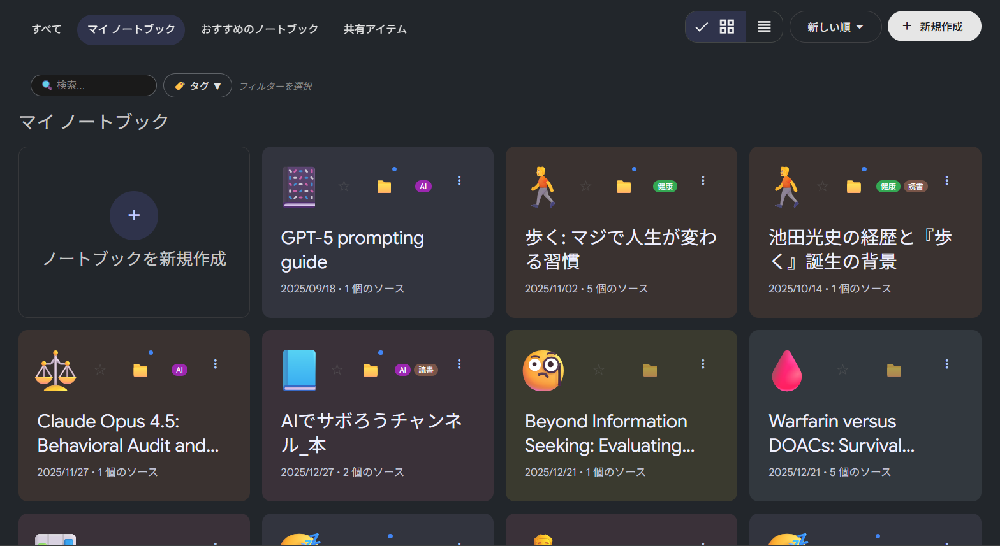
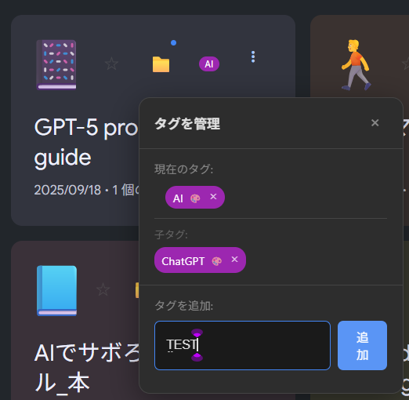

# NoteFolder

*Read this in other languages: [日本語](README.ja.md)*

A Chrome extension for organizing and managing NotebookLM projects with tags.



## Features

- **Tagging**: Add multiple tags to each project freely
- **Hierarchical Tags**: Organize with parent-child relationships (e.g., Work/ProjectA)
- **Drag & Drop**: Change parent-child relationships and merge tags via D&D
- **Filtering**: Filter projects by tags
- **Sorting**: Sort by name or tag count
- **Sync**: Automatically sync tag information across Chrome accounts
- **Lightweight**: No external server required, works locally

## Installation

### Method 1: From GitHub Releases (Recommended)

1. Download the latest ZIP file from the [Releases](https://github.com/rm007080/NoteFolder/releases/tag/v1.0.0) page
2. Extract the ZIP file
3. Open `chrome://extensions` in Chrome
4. Enable "Developer mode" in the top right
5. Click "Load unpacked"
6. Select the extracted folder

### Method 2: From Source Code

1. Clone or download this repository
   ```bash
   git clone https://github.com/rm007080/NoteFolder.git
   ```
2. Open `chrome://extensions` in Chrome
3. Enable "Developer mode" in the top right
4. Click "Load unpacked"
5. Select the cloned folder

## Usage

### Adding Tags

1. Open [NotebookLM](https://notebooklm.google.com/)
2. Click the 📁 icon on each project in the project list
3. Enter a tag in the popover and click "Add"



### Filtering

1. Click the "🏷️ Tags ▼" button at the top of the page
2. Select the tag you want to filter by
3. Only projects with the selected tag will be displayed

### Sorting

1. Click the "📊 Default ▼" button at the top of the page
2. Select sort order
   - Default: NotebookLM's standard order
   - Name (A→Z / Z→A)
   - Tag count (More→Less)

### Deleting Tags

**To remove a tag from a project:**
- Click 📁 icon → Click × next to the tag

**To completely delete a tag:**
- Click "🏷️ Tags ▼" → Click × next to the tag → Confirm in the dialog

### Hierarchical Tags (Drag & Drop)

1. Click the 📁 icon to open the popover
2. Drag a tag and drop it onto another tag
3. It becomes a child tag of the drop target (e.g., drop "Exercise" on "Health" → "Health/Exercise")

**Dropping on same-name tags:**
- Dropping on a tag with the same name automatically merges tags across all projects

## Notes

- **Supported Browser**: Google Chrome (may work on Chromium-based browsers)
- **Supported Site**: NotebookLM (https://notebooklm.google.com/) only
- **Data Storage**: chrome.storage.sync (synced with your Google account)
- **External Communication**: None (privacy-safe)

## Disclaimer

This extension is not an official product of Google or NotebookLM.
It is an unofficial third-party tool.

## Permissions

This extension uses only the minimum necessary permissions:

- `storage`: Store tag information, colors, pin status, etc.
- `host_permissions` (`https://notebooklm.google.com/*`): Inject UI only on NotebookLM

## Privacy

- No external servers are used
- Data is stored only in `chrome.storage.sync` and is not transmitted externally

## Stored Data

The following data is stored in `chrome.storage.sync`:

- Project ID
- Project name (retrieved from NotebookLM's screen)
- Tags (including hierarchical tags)
- Tag colors
- Pin status
- UI settings (dropdown height, expanded state, etc.)

## Known Limitations

- May stop working if NotebookLM's DOM structure changes
- Chrome sync may take a few seconds to reflect
- Chrome sync storage has capacity and key count limitations

## Troubleshooting

If the UI is not displayed:
1. Verify you are on `https://notebooklm.google.com/`
2. Click "Reload" for NoteFolder in `chrome://extensions`
3. Reload the NotebookLM page

If sync is not reflected:
- Wait a few seconds or reload the page

## Uninstallation and Data Deletion

- Sync data may remain on Chrome's side even after removing the extension
- To completely delete, remove extension data from Chrome's sync settings

## For Developers

Tech Stack:
- Chrome Extension Manifest V3
- Vanilla JavaScript (no frameworks)
- chrome.storage.sync API

## License

MIT License - See [LICENSE](LICENSE) for details

## Feedback

Please report bugs or feature requests via [Issues](../../issues).
